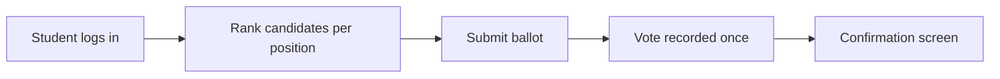

# Student Election System

**By students, for students.**

The Student Election System (SES) is an online platform built for Army Public School Bolarum to run fair, organized student cabinet elections. Students cast their votes from any device with a browser. Election organizers manage everything—voters, candidates, schedules, and results—from a dedicated admin area.

SES uses **ranked-choice voting**, which means voters can rank candidates in order of preference rather than picking just one name. That helps produce winners who reflect what the student body actually wants, even when no single candidate gets a majority on the first count.

---

## Table of Contents

- [Demo Videos](#demo-videos)
- [Who This Is For](#who-this-is-for)
- [What You Can Do](#what-you-can-do)
- [How Voting Works](#how-voting-works)
- [For Students: Casting a Vote](#for-students-casting-a-vote)
- [For Organizers: Running an Election](#for-organizers-running-an-election)
- [Security and Fairness](#security-and-fairness)
- [Getting the App Running Locally](#getting-the-app-running-locally)
- [Included Resources](#included-resources)
- [Project Overview](#project-overview)

---

## Demo Videos

Short walkthroughs that show the system in action:

| Video | Who it's for | Link |
|-------|--------------|------|
| **Voter Demo** | Students learning how to log in and cast a ballot | [Watch on YouTube](https://youtu.be/QSSCem8ObhI) |
| **Admin Demo** | Organizers setting up and managing an election | [Watch on YouTube](https://youtu.be/W_l-soSGR_k) |

These links can also be added in **Settings** so they appear directly on the login and admin pages during an election.

---

## Who This Is For

| Audience | What SES provides |
|----------|-------------------|
| **Students** | A simple login, a guided voting experience, and a confirmation when their ballot is recorded |
| **Election organizers** | Tools to set up positions, add candidates, import the voter list, watch turnout live, and view detailed results |
| **School administrators** | A secure, auditable process with one vote per student and clear election windows |

---

## What You Can Do

### For students

- Sign in with a personal election number, class, and section
- Rank candidates for each open position by dragging them into order
- Watch optional campaign videos before deciding
- Suggest candidates for certain advisory roles, when enabled
- Receive a clear confirmation once voting is complete

### For organizers

- **Dashboard** — See total voters, turnout, candidate counts, and whether the election is live, scheduled, or not yet started
- **Voters** — Import a list from a spreadsheet, add or edit students manually, search and filter, and export the registry
- **Candidates** — Create election positions (for example, Head Boy, Head Girl, House Captain), attach candidates, and set how many winners each role needs
- **Analytics** — View ranked-choice results with round-by-round breakdowns, first-choice counts, and suggestion summaries
- **Settings** — Schedule start and end times, link tutorial videos, manage admin access, and reset the election when needed

---

## How Voting Works

Ranked-choice voting (also called instant runoff) works like this:

1. **First choices are counted.** If someone receives more than half of the active votes for a position, they win.
2. **If nobody has a majority**, the candidate with the fewest first-choice votes is removed from the running.
3. **Those ballots move to each voter's next choice** among the remaining candidates.
4. **The process repeats** until the required number of winners is found.

This approach reduces the need for runoff rounds and gives voters a way to express backup preferences without wasting their vote.



---

## For Students: Casting a Vote

1. Open the election website on your phone, tablet, or computer.
2. Enter your **election number** — a six-character code provided by the school.
3. Select your **class** and **section** to confirm your identity.
4. Tap **Cast Your Vote** to enter the ballot.
5. For each position, drag candidates into your preferred order (first choice at the top).
6. Review your rankings and submit.
7. You will see a confirmation page. Each student may vote only once.

Prefer a video? Watch the [Voter Demo](https://youtu.be/QSSCem8ObhI) on YouTube. A tutorial link may also appear on the login page during the election.

**Tip:** Double-check your election number and class/section before submitting. After five incorrect login attempts, access is temporarily locked to protect against guessing.

---

## For Organizers: Running an Election

### Before election day

1. Sign in to the admin area with an authorized school email account.
2. **Import voters** using a spreadsheet with columns for name, election number, class, and section. A sample file is included in the `resources` folder.
3. **Set up positions** — create each role students are electing and decide how many winners each role needs.
4. **Add candidates** to each position, including optional campaign video links.
5. **Configure the schedule** — set specific start and end times, or mark the election as always live for testing.
6. Add links to tutorial videos for voters and admins if helpful.

### During the election

- Monitor the dashboard for live turnout.
- Confirm the election status shows as **Live** within the scheduled window.

### After the election

- Open **Analytics** to see winners and how votes shifted across rounds.
- Export voter data if needed for records.
- Use **Settings** to reset the election when preparing for the next cycle.

New to the admin panel? Watch the [Admin Demo](https://youtu.be/W_l-soSGR_k) on YouTube for a full walkthrough.

---

## Security and Fairness

SES is designed so elections stay trustworthy and easy to supervise:

- **One vote per student** — once a ballot is submitted, that student cannot vote again.
- **Two-step voter login** — election number plus class and section reduces the chance of someone else using a code.
- **Login attempt limits** — repeated failed logins trigger a temporary lockout.
- **Separate access for voters and admins** — students use their election credentials; organizers sign in with verified school email accounts.
- **Scheduled windows** — voting can be restricted to defined start and end times.
- **Transparent counting** — ranked-choice results show each elimination round, not just a final number.

---

## Getting the App Running Locally

These steps are for anyone setting up SES on their own computer—for development, testing, or hosting.

### What you need

- [Node.js](https://nodejs.org/) (version 18 or newer)
- A [Turso](https://turso.tech/) database (free tier works for getting started)
- A [Clerk](https://clerk.com/) account for admin sign-in

### Setup

1. **Clone the repository** and open the project folder.

2. **Install dependencies:**

   ```bash
   npm install
   ```

3. **Create your environment file.** Copy `.env.example` to `.env.local` and fill in the values:

   | Variable | Purpose |
   |----------|---------|
   | `TURSO_DATABASE_URL` | Address of your database |
   | `TURSO_AUTH_TOKEN` | Database access token |
   | `JWT_SECRET` | Secret used to secure voter sessions |
   | `CLERK_SECRET_KEY` | Clerk private key for admin authentication |
   | `NEXT_PUBLIC_CLERK_PUBLISHABLE_KEY` | Clerk public key |

4. **Prepare the database:**

   ```bash
   npm run db:push
   npm run seed
   ```

   The seed step creates default election settings and protected admin accounts.

5. **Start the app:**

   ```bash
   npm run dev
   ```

   Open [http://localhost:3000](http://localhost:3000) in your browser.

### Useful commands

| Command | What it does |
|---------|--------------|
| `npm run dev` | Starts the app for local development |
| `npm run build` | Prepares the app for production |
| `npm run start` | Runs the production build |
| `npm run db:push` | Applies database schema changes |
| `npm run db:studio` | Opens a visual database browser |
| `npm run seed` | Initializes default settings and admins |

---

## Included Resources

### Demo videos (YouTube)

| Video | Link |
|-------|------|
| Voter Demo | [https://youtu.be/QSSCem8ObhI](https://youtu.be/QSSCem8ObhI) |
| Admin Demo | [https://youtu.be/W_l-soSGR_k](https://youtu.be/W_l-soSGR_k) |

### Files in the `resources` folder

| File | Description |
|------|-------------|
| `sample_voter_list.csv` | Example spreadsheet format for importing students |
| `voter_tutorial.mp4` | Local copy of the voter walkthrough |
| `admin_demo.mp4` | Local copy of the admin walkthrough |

Upload the YouTube links above in **Settings** so they appear as clickable links on the login and admin pages during an election.

---

## Project Overview

SES is a web application with two main areas:

- **Public voting site** (`/`) — where students log in and cast ballots
- **Admin panel** (`/admin`) — where organizers manage the full election lifecycle

Behind the scenes, the app stores voter records, positions, candidates, and ranked ballots in a SQLite-compatible database (hosted on Turso). Ranked-choice results are calculated using an instant-runoff engine that produces round-by-round tallies for the analytics page.

The interface uses a warm orange theme, smooth animations, and a layout that works well on both phones and desktops—so students can vote comfortably from whatever device they have.

---

## License

This project is private and intended for use by Army Public School Bolarum and its authorized contributors.

---

*Student Election System — Army Public School Bolarum*
